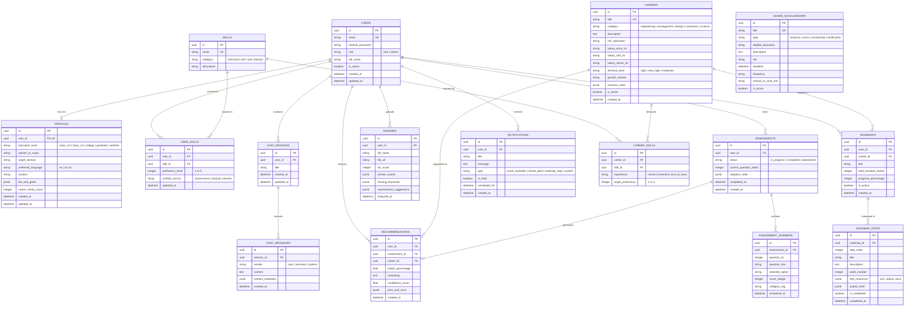

# PathFinder AI - Entity Relationship (ER) Diagram

```mermaid
erDiagram
    USERS ||--o| PROFILES : "has one"
    USERS ||--o{ USER_SKILLS : "possesses"
    USERS ||--o{ ASSESSMENTS : "takes"
    USERS ||--o{ RECOMMENDATIONS : "receives"
    USERS ||--o{ ROADMAPS : "follows"
    USERS ||--o{ RESUMES : "uploads"
    USERS ||--o{ CHAT_SESSIONS : "conducts"
    USERS ||--o{ NOTIFICATIONS : "receives"

    SKILLS ||--o{ USER_SKILLS : "tracked in"
    SKILLS ||--o{ CAREER_SKILLS : "required by"

    CAREERS ||--o{ CAREER_SKILLS : "demands"
    CAREERS ||--o{ RECOMMENDATIONS : "suggested as"
    CAREERS ||--o{ ROADMAPS : "targeted in"

    ASSESSMENTS ||--o{ ASSESSMENT_ANSWERS : "contains"
    ASSESSMENTS ||--o| RECOMMENDATIONS : "generates"

    ROADMAPS ||--o{ ROADMAP_STEPS : "composed of"

    CHAT_SESSIONS ||--o{ CHAT_MESSAGES : "contains"

    USERS {
        uuid id PK
        string email UK
        string hashed_password
        string role "user | admin"
        string full_name
        boolean is_active
        datetime created_at
        datetime updated_at
    }

    PROFILES {
        uuid id PK
        uuid user_id FK, UK
        string education_level "class_10 | class_12 | college | graduate | switcher"
        string stream_or_major
        string target_domain
        string preferred_language "en | hi | ta"
        string location
        jsonb bio_and_goals
        integer career_clarity_score
        datetime created_at
        datetime updated_at
    }

    SKILLS {
        uuid id PK
        string name UK
        string category "technical | soft | tool | domain"
        string description
    }

    USER_SKILLS {
        uuid id PK
        uuid user_id FK
        uuid skill_id FK
        integer proficiency_level "1 to 5"
        string verified_source "assessment | manual | resume"
        datetime updated_at
    }

    CAREERS {
        uuid id PK
        string title UK
        string category "engineering | management | design | commerce | science"
        text description
        string min_education
        string salary_entry_inr
        string salary_mid_inr
        string salary_senior_inr
        string demand_level "high | very_high | moderate"
        string growth_outlook
        jsonb common_roles
        boolean is_active
        datetime created_at
    }

    CAREER_SKILLS {
        uuid id PK
        uuid career_id FK
        uuid skill_id FK
        string importance "critical | essential | nice_to_have"
        integer target_proficiency "1 to 5"
    }

    ASSESSMENTS {
        uuid id PK
        uuid user_id FK
        string status "in_progress | completed | abandoned"
        integer current_question_index
        jsonb adaptive_state
        datetime completed_at
        datetime created_at
    }

    ASSESSMENT_ANSWERS {
        uuid id PK
        uuid assessment_id FK
        integer question_id
        string question_text
        string selected_option
        integer score_weight
        string category_tag
        datetime answered_at
    }

    RECOMMENDATIONS {
        uuid id PK
        uuid user_id FK
        uuid assessment_id FK
        uuid career_id FK
        float match_percentage
        text reasoning
        float confidence_score
        jsonb pros_and_cons
        datetime created_at
    }

    ROADMAPS {
        uuid id PK
        uuid user_id FK
        uuid career_id FK
        string title
        integer total_duration_weeks
        integer progress_percentage
        boolean is_active
        datetime created_at
    }

    ROADMAP_STEPS {
        uuid id PK
        uuid roadmap_id FK
        integer step_order
        string title
        text description
        integer week_number
        jsonb free_resources "urls, videos, docs"
        jsonb project_brief
        boolean is_completed
        datetime completed_at
    }

    RESUMES {
        uuid id PK
        uuid user_id FK
        string file_name
        string file_url
        integer ats_score
        jsonb section_scores
        jsonb missing_keywords
        jsonb improvement_suggestions
        datetime analyzed_at
    }

    CHAT_SESSIONS {
        uuid id PK
        uuid user_id FK
        string title
        datetime created_at
        datetime updated_at
    }

    CHAT_MESSAGES {
        uuid id PK
        uuid session_id FK
        string sender "user | assistant | system"
        text content
        jsonb context_metadata
        datetime created_at
    }

    EXAMS_SCHOLARSHIPS {
        uuid id PK
        string title UK
        string type "entrance_exam | scholarship | certification"
        string eligible_education
        text description
        string link
        datetime deadline
        string frequency
        string reward_or_seat_info
        boolean is_active
    }

    NOTIFICATIONS {
        uuid id PK
        uuid user_id FK
        string title
        text message
        string type "exam_reminder | streak_alert | roadmap_step | system"
        boolean is_read
        datetime scheduled_for
        datetime created_at
    }
```

